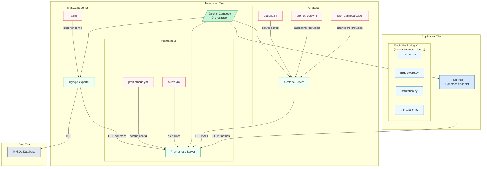

<font face="楷体">

## 简介

作为一个附加仓库，旨在实现flask项目的简单监控，关注延迟、流量、错误率和饱和度四个指标，另外针对Mysql方面也有着简单监控，更多的还待后续拓展，现在再添加一个k6压测，一并置于docker里面。

**简单架构**


### 引入项目
```shell
git clone https://github.com/Jack-samu/flask-monitoring-kit.git vendor/flask-monitoring-kit
```

**修改项目根路径yml部署文件**
```yml
# 添加如下配置
include:
  - ./vendor/flask-monitoring-kit/docker-compose-monitoring.yml
```

**flask项目根路径下添加如下配置**
```
# grafana账号
GF_SECURITY_ADMIN=阿巴巴
GF_SECURITY_ADMIN_PWD=aBb111@
```

### 在flask主体项目中进行应用：
**添加应用代码：**
```python
# 例，在工厂函数中添加
import sys
from pathlib import Path

sys.path.append(str(Path(__file__).parent.parent/"vendor"/"flask-monitoring-kit"))

def create_app(name='blog-app', config = Config):

    ...
    
    # 监控初始化
    from monitoring import init_metrics
    init_metrics(app, db)

    return app
```

### 命令执行
```shell
# 启动，项目根路径下
docker compose up -d --build

# 停止
docker compose down

# 停止并清理对应build得镜像
docker compose down --rmi local

# 查看某个service日志
docker logs container_name
```

### 预想结果

```shell
# 对于prometheus和mysqld-exporter
```